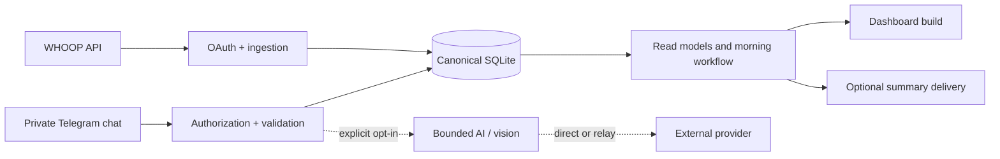

# Architecture

The system is a local-first pipeline with optional external boundaries. The
database and deterministic validators remain authoritative; providers and
language models are replaceable inputs.

## Boundaries

### Ingestion

`auth.py`, `whoop_auth.py`, and `fetch_data.py` handle OAuth and provider
records. Token writes are locked, atomic, permission-aware, and designed to
fail closed when a rotating refresh result is ambiguous.

### Canonical state

`workouts_db.py`, `daily_log.py`, `phase2_store.py`, and
`canonical_read_model.py` define durable state and read contracts. Generated
HTML, markdown, and model prose are not canonical inputs.

### Messaging

`telegram_bot.py` authorizes the configured private chat and sender, reserves an
idempotency key, validates structured intent, writes through deterministic
tools, and tracks reply delivery. Group chats are rejected.

### Optional AI

`gemini_client.py`, `gemini_transport.py`, `bounded_agent.py`, and
`cardio_vision.py` form an optional provider boundary. AI flags are explicit;
the model receives bounded context and declared functions. Relay requests use
HTTPS validation, bearer authentication, payload limits, and no redirects.

Image processing is opt-in. Before provider transfer, the current export
decodes, reorients, bounds, resizes, and re-encodes images without EXIF
metadata. The operator must still crop visible private content before upload.

### Morning workflow

`morning_flow.py`, `morning_context.py`, `morning_observability.py`, and
`report_delivery.py` coordinate scheduled stages. Each stage has durable safe
outcomes; failed stages block dependent work rather than silently producing a
plausible but incomplete report.

### Dashboard

`build_dashboard.py` combines `dashboard_template.html` and sorted
`dashboard_ui/` modules. It validates contracts and replaces generated output
atomically. The dashboard has no built-in authentication; the operator must
provide a private access layer.

### Deployment and recovery

`deploy.py`, `release_manifest.py`, `backup_database.py`, and `token_handoff.py`
cover SSH host verification, release checks, backups, token installation, and
rollback gates. A public reader should treat these as reviewed building blocks,
not as a turnkey hosting recipe.

## Trust model

Python owns authorization, schemas, dates, writes, confirmation, and read-back.
External providers can fail, return malformed data, or retain data according to
their own policies. The code therefore records safe categories and validates
provider results before they can affect local state.

## Privacy boundary

The full data inventory and retention limitations are in [PRIVACY.md](../PRIVACY.md).
The public repository contains no runtime database, generated dashboard,
provider response, log, backup, video, or credential. The sole reviewed
exception is the README-linked `docs/dashboard-live-example.png` screenshot;
it visibly contains dashboard metrics and a date range, but no account
identifier, URL, source path, credential, or authenticated control. All other
personal data and media are excluded.
